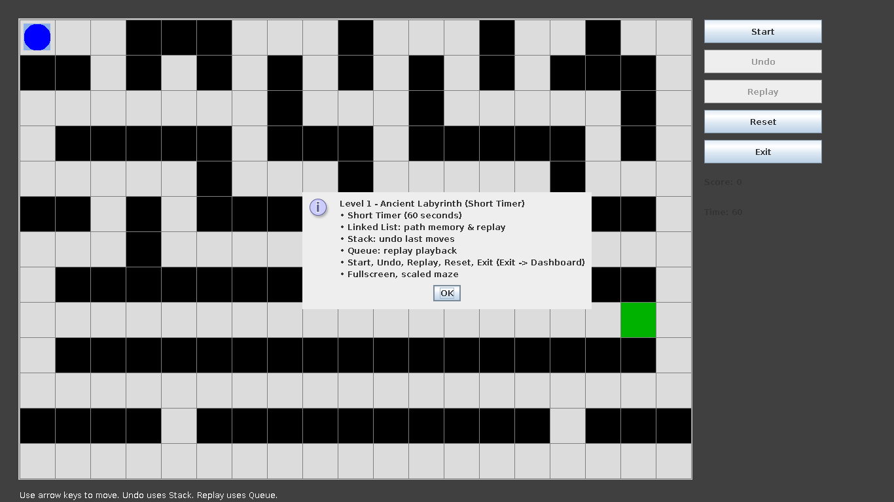

# 🧩 Maze Adventure — DSA Temporal Maze Kingdom

A 6-level Java Swing maze game built as a **Data Structures & Algorithms** course project. Each level is themed as a jump through time (Ancient Labyrinth → Cyber Future → Random Rift → 2D Temporal Rift → 3D Kingdom → 360° Finale), and each one deliberately puts a different DSA concept to work — from a hand-rolled linked list and stack, up to Dijkstra, A*, and a self-balancing AVL tree leaderboard.

It also has a small login/registration flow, a dashboard/level-select hub, sound effects, undo/replay, timers, and a difficulty system — built to demonstrate applied DSA, not just theory.

> Built while studying a Data Structures & Algorithms course, as a way to actually *use* the structures instead of only implementing them for assignments.

---

## 📸 Screenshots

| Main Menu | Login | Register |
|---|---|---|
|  |  |  |

**Dashboard — Level Select**


| Level 1 — Ancient Labyrinth | Level 2 — Cyber Future |
|---|---|
|  |  |

**Level 6 — Finale (Hint, Shortest Path, AVL Leaderboard, Moving Blocks)**


---

## ✨ Features

- **6 progressively harder levels**, each unlocking a new mechanic on top of the last
- **Login / Register** flow with a persisted user list
- **Undo** (step back through your last move) and **Replay** (auto-walk your recorded path)
- **Coins & traps** that spawn in a fixed, fair order per run
- **Difficulty levels** (Easy / Medium / Hard) from Level 3 onward, changing maze size/generation
- **Pathfinding hints** — Dijkstra and A* — from Level 4 onward, so a stuck player can ask for help
- **Dynamic obstacles** — moving blocks — in the finale level
- **Persistent top-score leaderboard** backed by a self-balancing AVL tree in the finale level
- **Sound effects** for coins, traps, and winning
- Per-level timers, scoring, and a "how this level works" briefing popup on start

---

## 🧠 Data Structures & Algorithms — where each one lives

This is the core of the project: every level is a small showcase of a specific structure or algorithm, applied to an actual gameplay problem instead of a textbook exercise.

| # | Level | New concept introduced | Used for | Key file(s) |
|---|-------|------------------------|----------|--------------|
| 1 | **Ancient Labyrinth** | Doubly Linked List, Stack, Queue | Path memory & replay, undo (LIFO), replay playback (FIFO) | [`PathLinkedList.java`](src/oneLevel/PathLinkedList.java), [`MoveStack.java`](src/oneLevel/MoveStack.java), [`ReplayQueue.java`](src/oneLevel/ReplayQueue.java) |
| 2 | **Cyber Future** | Same core structures, applied to a fresh maze | Coin/trap spawn order via FIFO queue | [`GameLogic.java`](src/secondLevel/GameLogic.java) |
| 3 | **Random Rift Maze** | Difficulty-driven procedural generation | Maze layout now generated per difficulty instead of fixed | [`GameLogic.java`](src/thirdLevel/GameLogic.java), [`Difficulty.java`](src/thirdLevel/Difficulty.java) |
| 4 | **2D Temporal Rift** | **Dijkstra's Algorithm** (priority queue / min-heap) | Shortest-path hint from player to exit | [`DijkstraSolver.java`](src/fourthLevel/DijkstraSolver.java) |
| 5 | **3D Maze Kingdom** | **A\* Search**, alongside Dijkstra | Faster heuristic-guided pathfinding hint; run rating | [`AStarSolver.java`](src/fifthLevel/AStarSolver.java), [`DijkstraSolver.java`](src/fifthLevel/DijkstraSolver.java), [`Rating.java`](src/fifthLevel/Rating.java) |
| 6 | **360° Kingdom (Finale)** | **AVL Tree**, dynamic obstacle manager | Self-balancing tree keeps a sorted, persistent top-score leaderboard; a manager class moves wall blocks each tick | [`AVLTree.java`](src/sixLevel/AVLTree.java), [`LeaderboardEntry.java`](src/sixLevel/LeaderboardEntry.java), [`MovingBlockManager.java`](src/sixLevel/MovingBlockManager.java), [`AStarSolver.java`](src/sixLevel/AStarSolver.java), [`DijkstraSolver.java`](src/sixLevel/DijkstraSolver.java) |

**Summary of concepts covered:** Doubly Linked List, Stack (LIFO), Queue (FIFO), Priority Queue / Binary Heap, Dijkstra's Algorithm, A* Search, AVL Tree (self-balancing BST), and randomized maze generation.

---

## 🗂️ Project Structure

```
MAZE/
├── src/
│   ├── App.java                 # Entry point — launches the splash screen
│   ├── StartGame/                # Splash screen, main menu, login/register, shared UI helpers
│   ├── MainGame/                 # Dashboard (level-select hub)
│   ├── oneLevel/   … sixLevel/   # One package per level — GameLogic, GamePanel, Level*, Popup, SoundManager
│   └── ...
├── bin/                          # Compiled classes + bundled image/audio assets (build output)
├── lib/                          # External dependency jars (none required currently)
├── docs/screenshots/             # Screenshots used in this README
├── users.txt                     # Local flat-file user store (see ⚠️ Notes below)
└── README.md
```

---

## ✅ Prerequisites

- **Java Development Kit (JDK) 17 or later** — the project was built and compiled with **JDK 21**.
  Check your version with:
  ```bash
  java -version
  javac -version
  ```
- No external libraries are required — the game runs on the standard `javax.swing` / `java.awt` / `javax.sound.sampled` APIs only, so there's nothing to fetch from Maven/Gradle.
- **[Optional]** [Visual Studio Code](https://code.visualstudio.com/) + the [Java Extension Pack](https://marketplace.visualstudio.com/items?itemName=vscjava.vscode-java-pack) — the project already includes a `.vscode/settings.json` pointing at `src` and `bin`, so it opens and runs with no extra setup.
- A desktop environment capable of showing a GUI window (Swing needs a display — it won't run headless).

---

## ▶️ How to Run

### Option A — VS Code (recommended)
1. Open the `MAZE` folder in VS Code with the Java Extension Pack installed.
2. Open `src/App.java`.
3. Click **Run** above the `main` method (or press `F5`).

### Option B — Command line
From inside the `MAZE` folder:

```bash
# 1. Compile everything into bin/
javac -encoding UTF-8 -d bin $(find src -name "*.java")

# 2. Copy image/sound assets alongside the compiled classes
#    (only needed once, or after changing an asset)
find src -type f \( -name "*.png" -o -name "*.wav" -o -name "*.gif" \) \
  -exec bash -c 'dest="bin/${1#src/}"; mkdir -p "$(dirname "$dest")"; cp "$1" "$dest"' _ {} \;

# 3. Run it
cd bin && java App
```

---

## 🎮 Controls

- **Arrow keys** — move the player
- **Start** — begin the level's timer/run
- **Undo** — pop the last move off the Stack
- **Replay** — auto-walk the recorded path from the Linked List / Queue
- **Hint / Shortest Path** *(Level 4+)* — show the Dijkstra/A* computed path to the exit
- **Reset / Exit** — restart the level or return to the Dashboard

---

## 📝 Notes

- This is a **learning/academic project**, built to practice applying DSA concepts to something interactive rather than isolated unit exercises — it isn't a production application.
- Levels 1–2 use fixed, hand-designed maze layouts; from Level 3 onward mazes are generated per selected difficulty.
- Login/registration currently stores accounts in a local plaintext file (`users.txt`) for simplicity — there is **no password hashing, brute-force protection, or input sanitization** on that flow. This is fine for a local single-player course project, but it is **not** how credentials should be handled in anything user-facing or public. If you fork this for something beyond a class demo, that module is the first thing to replace (e.g. hashed passwords, a real embedded database instead of a flat file, and input validation).
- Image/sound assets are loaded from the compiled classpath (`bin/`), so the two build steps above (compile **and** copy assets) are both needed for sprites and sound effects to appear — compiling alone will run the game with a blank player icon and no sound.

---

## ✅ Conclusion

Maze Adventure started as a way to make a Data Structures & Algorithms course less abstract — instead of implementing a linked list, a stack, Dijkstra's algorithm, or an AVL tree in isolation, each one had to actually solve a real problem inside a working game: remembering a path, undoing a move, finding a shortest route, or keeping a leaderboard sorted. Building the game side — Swing UI, levels, login flow, sound, timers — took as much effort as the algorithms themselves, and that combination is really the point of the project: DSA knowledge applied end-to-end in something playable, not just correct on paper.
