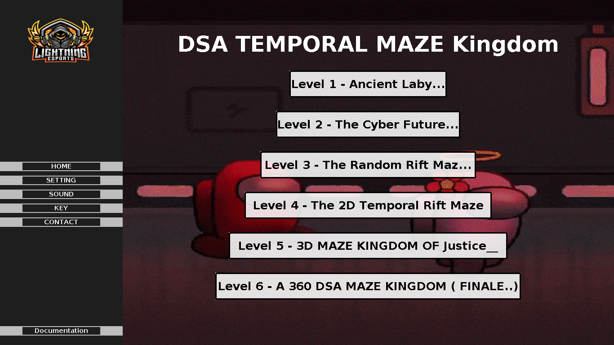
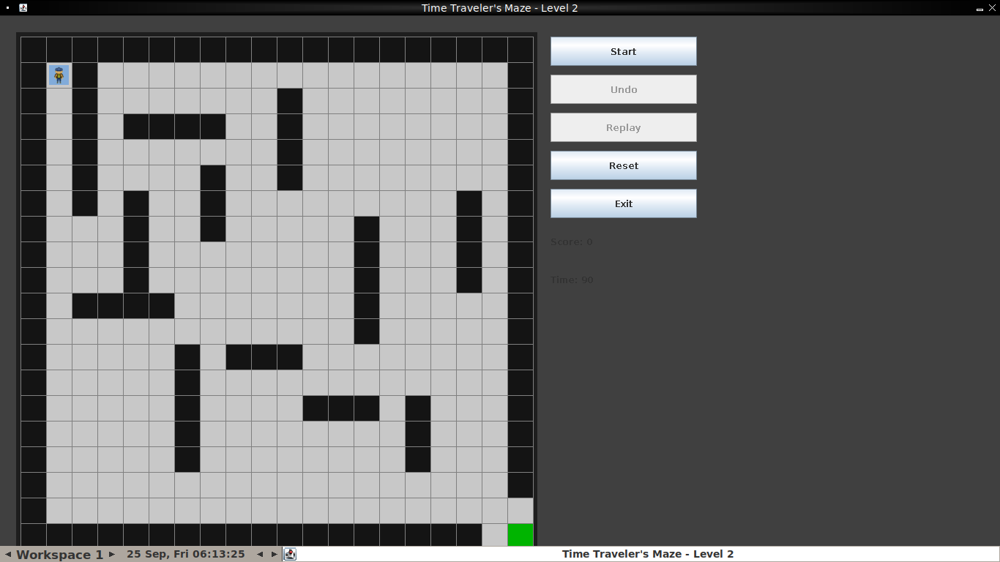
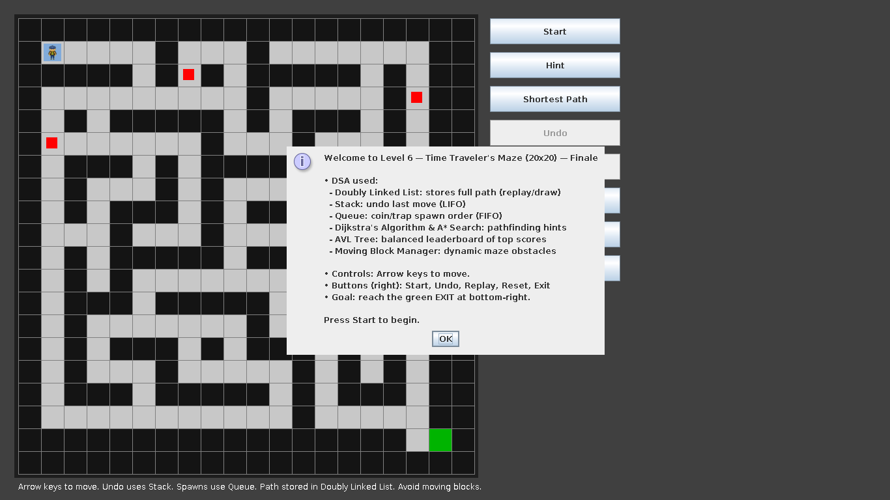

## Temporal Maze Adventure

A six level Java Swing maze game built as a Data Structures & Algorithms course project. Here each level is themed as a jump through time (Ancient Labyrinth → Cyber Future → Random Rift → 2D Temporal Rift → 3D Kingdom → 360° Finale) and each one deliberately puts a different DSA concept to work, from linked list and stack up to Dijkstra, A* and a self balancing AVL tree.

It also has a small login flow, a dashboard hub, sound effects, undo or replay, timers that i built to demonstrate applied DSA.

## Screenshots

| Main Menu | Login | Register |
|---|---|---|
|  |  |  |

**Dashboard**

**Level 1 — Ancient Labyrinth**

**Level 2 — Cyber Future**

**Level 6 — Finale**

## Features

Every level is a small showcase of a specific structure or algorithm applied to a gameplay.

| # | Level | DSA concept | Used for |
|---|-------|------------------------|----------|
| 1 | **Ancient Labyrinth** | Doubly Linked List, Stack, Queue | Path memory & replay, undo (LIFO), replay playback (FIFO) | 
| 2 | **Cyber Future** | Same core structures | Coin / trap spawn order via FIFO queue |
| 3 | **Random Rift Maze** | Procedural generation | Maze layout now generated per difficulty instead of fixed |
| 4 | **2D Temporal Rift** | Dijkstra's Algorithm (min-heap) | Shortest path hint from player to exit |
| 5 | **3D Maze Kingdom** | A* Search, Dijkstra | Faster heuristic guided path finding procedure |
| 6 | **360° Kingdom (Finale)** | AVL Tree | Self balancing tree keeps a sorted, persistent top score leaderboard|

**Summary:** Doubly Linked List, Stack (LIFO), Queue (FIFO), Heap, Dijkstra Algorithm, A* Search, AVL Tree (self-balancing) and randomized maze generation.

## How to Run

### Option A — VS Code
1. Open the `MAZE` folder in VS Code with the Java Extension Pack installed.
2. Open `src/App.java`.
3. Click **Run** above the `main` method (or press `F5`).

---

## Notes

- This is a **Academic project**, built to practice applying DSA concepts to something interactive, it isn't a production application. After passing the course, while leaning cyberSecurity, I test my built projects for vulnerabilities mapping to OWASP Top 10 and SANS Top 25.

## Conclusion

Maze Adventure started as a way to make a Data Structures & Algorithms course practical based, instead of implementing a linked list, a stack, Dijkstra algorithm, or an AVL tree in isolation, each one had to actually solve a real problem inside a working game like remembering a path, undoing a move, finding a shortest route or keeping a leaderboard sorted.
